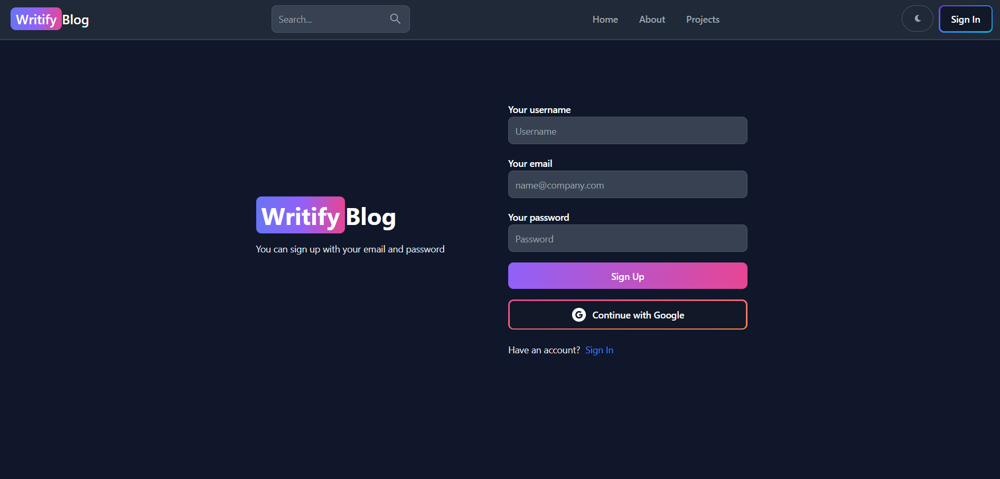
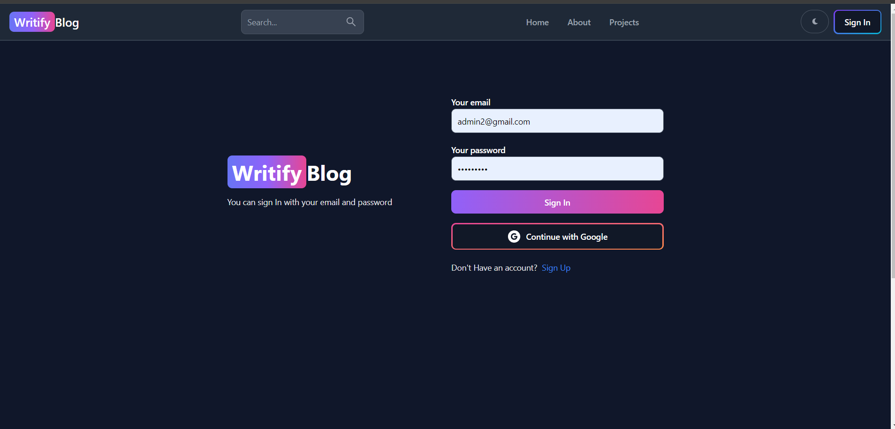
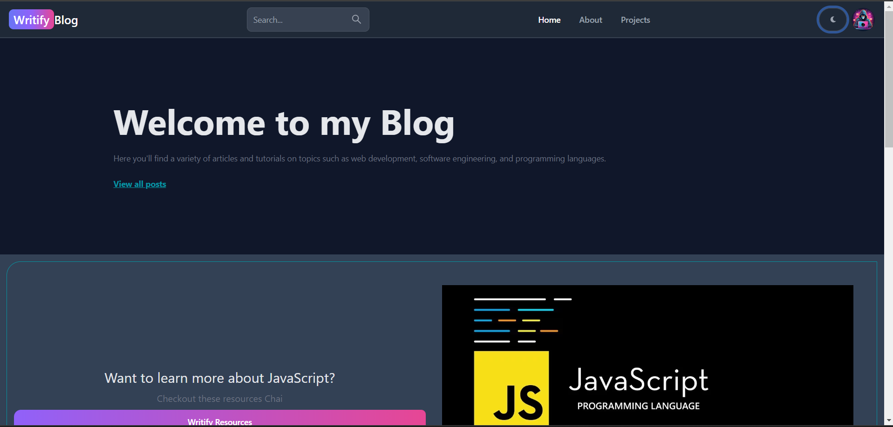
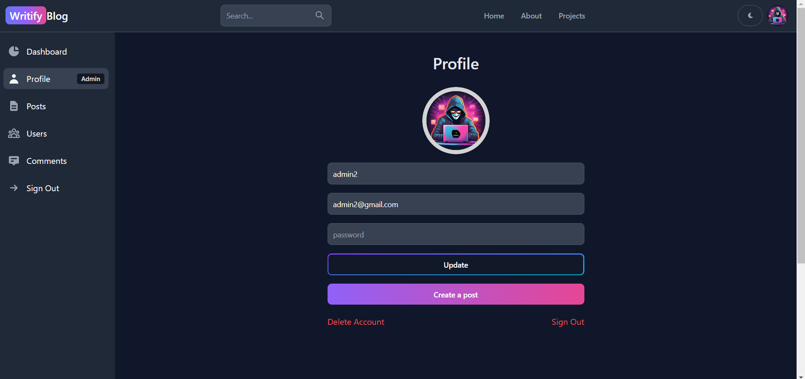
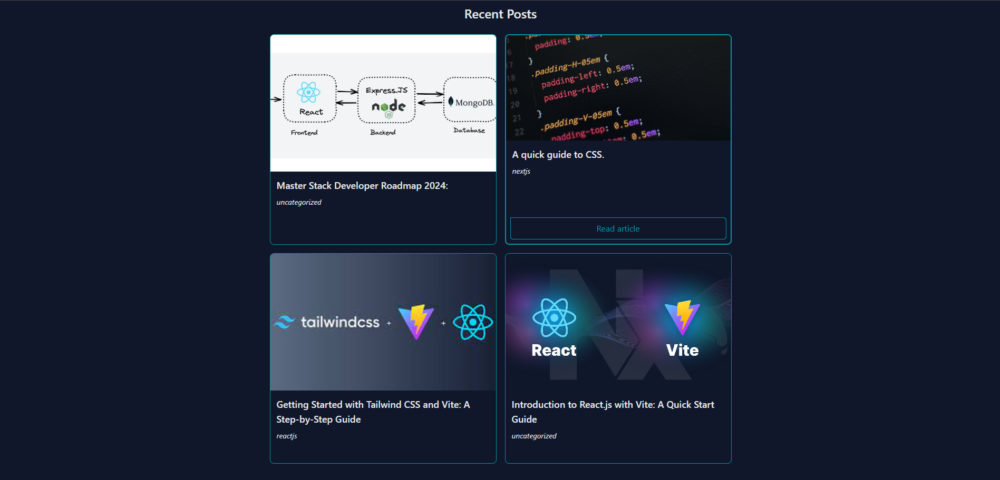

<h1 align="center">Writify - Feature-Rich Blogging Platform</h1>
<div align="center">
<a href="https://github.com/sudhanshu-77/Writify/issues"></a>
<a></a>
<a></a>
</div>


## <a align="left"> Live Website </a> [Link](https://writify-v1.onrender.com/).

### Objective:
The main objectives of this project are to develop a web application that allows users to:
*  Post the content. 
*   Edit, Delete the posts
* Track the Posts
* Like ,Dislike & Comment
  
### Scope:
The project will cover the following features:
* User Authentication: Secure user accounts with login and registration
  functionality.  
 
 * CRUD Operations: Users can create, edit, and delete their posts seamlessly. * Admin Panel:: 
   An administrative interface for content moderation and user
   management.

 * Interaction Features :Users can like, dislike, and comment on posts shared by
   others.

### Methodology:
The project will be developed by using the following technologies:
* 	Frontend: React, HTML, CSS, and JavaScript
* 	Backend: Node.js, Express.js, and MongoDB
* 	Other tools: Git, GitHub, and Visual Studio Code

### Proposed System:
Writify will be a versatile web application accessible on various devices with web
browsers. It will use APIs for enhanced functionality and incorporate features for
seamless content creation and interaction.
Features:
The following are the key features of the AirTracker application:
* User Authentication
* Post Creation, Editing, and Deletion
* Admin Panel for Content Management  Like, Dislike, and Comment Function

### Implementation Plan:
The following is a high-level implementation plan for the AirTracker project:
1.  Design a robust database schema for user data and post content.
2.  Develop a secure backend API handling user authentication, post management, and admin functionalities..
3.  Create an interactive frontend user interface for a seamless user experience.
4. Integrate frontend and backend components to ensure smooth functionality.
5.  Test the application.
6.  Deploy the application.

### Team Members:
The following are the team members and their roles:
* 	Pankaj Ajmera: Frontend development & Backend development
* 	Sudhanshu Tripathi: Frontend development & Backend development
* 	 Harsh Agarwal : Frontend & Backend development

### Resources Required:
The following resources are required for the project:
* 	Frontend technologies: HTML, CSS, JavaScript, and React
* 	Backend technologies: Node.js, Express.js, and MongoDB
* 	Basic tools: Git, GitHub, and Visual Studio Code

### References:
The following resources will be used as references for the project:
* Online resources: YouTube, Google, Technologies Documentations, etc.
* Other resources: Mentor guidance.
<p align="right">(<a href="#top">Back to top</a>)</p>

## Requirements
- mongoDB
- expressjs
- reactjs
- nodejs
- npm

## Getting started

To get started with this project, first install the npm dependencies:

```bash
npm install
```

Next, run the development server:

```bash
npm run dev
```
Next, open localhost server:

```bash
localhost:5173
```


### Output:


## SignUp :


## SignIn :


## Home :


## Admin Dashboard :


## Blog Posts:



<p align="right">(<a href="#top">Back to top</a>)</p>


